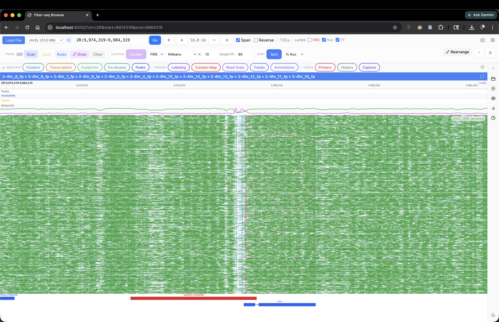

# FiberBrowser

FiberBrowser is an interactive, single-molecule-genomics-focused genome
browser for DAF-seq and Fiber-seq, but which supports a wide range of
genomic datatypes. It is the visualization component of the
[FiberHMM](https://github.com/fiberseq/FiberHMM) pipeline, but does not
require footprints to be useful. It allows fast and convenient exploration
and quantitative analysis of per-read footprinting and
methylation/deamination patterns across 1000s of reads, providing extensive
functionality missing from modern browsers which focus on aggregate
short-read tracks.

*2-4 hr Fiber-seq at the* eve *locus in Drosophila embryos. 1,259 reads span
the region; the browser draws every footprint on every read, and every
downstream analysis is computed on the full read set.*

## Features

- **Per-read heatmaps** of m6A / DAF accessibility, drawn as a single canvas
  layer so loci with thousands of reads stay responsive.
- **Single-molecule clustering** on CRE accessibility patterns, with
  per-cluster metaprofiles, merge / reorder / hide controls, and a sortable
  read table.
- **Direct comparison across perturbations or timepoints** -- load multiple
  datasets at once and joint-cluster them so the same single-molecule state
  definitions apply across conditions, making perturbation effects readable
  at single-read resolution.
- **Customizable footprint labeling** -- recolor footprints by user-defined
  rules (Pol II, NFR, TF, nucleosome) using size and overlap criteria.
- **Transcription-state quantification** -- filter and count reads matching
  paused, PIC, elongating, or hyperbound Pol II configurations at a
  selected gene.
- **Footprint inspection and motif enrichment** -- pull motif hits and
  FASTA for any single footprint and compare to references (ChIP-nexus,
  motif databases).
- **DAF-seq primer design** -- design and BLAST-check primers for targeted
  DAF-seq amplicons directly from the browser, with IDT / Twist CSV export.
  See also the [Primer Design](../protocol/primer-design.md) guidelines.
- **Headless / API mode and Jupyter control** -- drive the browser
  programmatically via its FastAPI endpoints or a Python client; load
  regions, pull cluster assignments, fetch co-accessibility matrices, and
  render figures directly from a notebook.
- **Local LLM copilot** (optional) -- natural-language commands that drive
  the browser via a model running on your machine (MLX on Mac, Ollama
  elsewhere); doubles as an interactive tutorial for discovering features.
- ...and more.

FiberBrowser sits downstream of the [DAF-QC Pipeline](daf-qc.md): once you
have QC'd reads and called footprints, FiberBrowser is where you explore
them.

## Early access

FiberBrowser is in pre-release while we finalize the public repository. If
you'd like to try it on your data, reach out at tommywtullius [at]
gmail.com.
